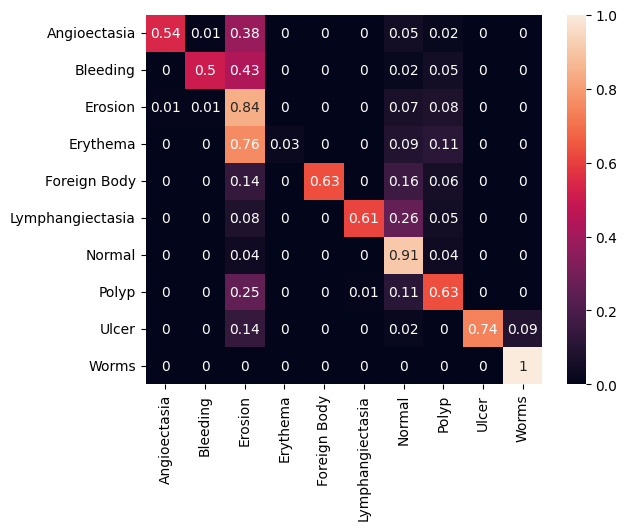

# Introduction
This is our submission to the Vision Capsule Endoscopy Challenge 2024 hosted by MISAHUB. Capsule Endoscopy is a wireless endoscopy technique that results in 70,000 to 100,000 image frames. The doctor is then required to examine each frame to determine the ailment that the patient is suffering from. This task is therefore extremely monotonous, time-consuming and prone to human-errors. The VCE challenge aims to solve this problem by having the participants train a Deep Learning model that is able to determine the frames that are of interest to the doctor and also classify the frame as having one of the multiple types of diseases possible in the GI tract. There are total 10 classes of diseases covered in this challenge:
- Angioectasia
- Bleeding
- Erosion
- Erythema
- Foreign Body
- Lymphangiectasia
- Normal
- Polyp
- Ulcer
- Worms

For our solution, we attempted to train a CNN based model that is able to classify the frames into one of the 10 classes. Please check out our model weights and the corresponding paper below.

Do add the best_accuracy.ckpt from [here](https://drive.google.com/file/d/191zDIFdaZkmYwJUGG0N5AGj0-MRDjopF/view?usp=sharing)

Fig share [paper](https://figshare.com/articles/preprint/CapsuleNet_A_Deep_Learning_Model_To_Classify_GI_Diseases_Using_EfficientNet-b7/27297267?file=49974297)

arXiv [paper](http://arxiv.org/abs/2410.19151)
# Model
Our proposed model uses an EfficientNet B7 model from project MONAI as the backbone, followed by two hidden linear layers using PReLU activations. The output is a linear layer with softmax activation with 10 nodes.

  

# Training
Training and validation was done on the training and validation set provided by MISAHUB [here](https://doi.org/10.6084/m9.figshare.26403469.v1) The train set was extremely imbalanced, with over 28000 images for the largest class, while the smalles class (Worms) had just over 250 images. To address this issue we attempted using augmentation of the classes with lesser number of instances, and randomly sampled images from larger classes. We also attempted using Focal loss, and class weigts to address the imbalance issue, with poor results. The final model was trained with different augmentations for different classes.
- Erosion and Normal classes had 5000 images each (erosion was augmented, while Normal images were randomly sampled)
- Angioectasia and Polyp with 4000 images each (after augmentation)
- Worms with 1264 images (after augmentation)
- remaining classes had 3000 images each.

The loss and accuracy metrics on the training set were as follows: 

  <figure style="display:inline-block; margin: 10px;">
    
    <figcaption style="text-align: center;">Train accuracy vs train steps
    </figcaption>
  </figure>
  <figure style="display:inline-block; margin: 10px;">
    
    <figcaption style="text-align: center;">Train loss vs train step</figcaption>
  </figure>

The loss and accuracy metrics on the validation set were as follows:

  <figure style="display:inline-block; margin: 10px;">
    
    <figcaption style="text-align: center;">Validation accuracy vs Validation steps
    </figcaption>
  </figure>
  <figure style="display:inline-block; margin: 10px;">
    
    <figcaption style="text-align: center;">Validation loss vs Validation step</figcaption>
  </figure>

# Results
The final results on the validation set can be seen through the confusion matrix below.

  

On the Validation set, we achieved a micro accuracy value of 0.845 and a macro accuracy of 0.643. The f1-score achieved on individual classes outperformed the VGG16 baseline model provided by Misahub on all the classes except Erythema, with an overall accuracy of 0.85 compared to the baseline accuracy of 0.71. The model performed poorly for the erythema class and confused it with erosion throughout the validation process.
We also compared our results to the baseline model provided by MISAHUB which can be seen in the table below.

<table>
  <thead>
    <tr>
      <th rowspan="2" align="center">Class</th>
      <th colspan="3" align="center">VGG16 (by MISAHUB)</th>
      <th colspan="3" align="center">CapsuleNet</th>
      <th rowspan="2" align="center">Support</th>
    </tr>
    <tr>
      <th>Precision</th>
      <th>Recall</th>
      <th>F1-score</th>
      <th>Precision</th>
      <th>Recall</th>
      <th>F1-score</th>
    </tr>
  </thead>
  <tbody>
    <tr>
      <td>Angioectasia</td>
      <td>0.33</td>
      <td>0.50</td>
      <td>0.40</td>
      <td>0.88</td>
      <td>0.54</td>
      <td>0.67</td>
      <td>497</td>
    </tr>
    <tr>
      <td>Bleeding</td>
      <td>0.51</td>
      <td>0.57</td>
      <td>0.54</td>
      <td>0.84</td>
      <td>0.50</td>
      <td>0.62</td>
      <td>359</td>
    </tr>
    <tr>
      <td>Erosion</td>
      <td>0.29</td>
      <td>0.40</td>
      <td>0.33</td>
      <td>0.43</td>
      <td>0.84</td>
      <td>0.57</td>
      <td>1155</td>
    </tr>
    <tr>
      <td>Erythema</td>
      <td>0.13</td>
      <td>0.37</td>
      <td>0.19</td>
      <td>0.91</td>
      <td>0.03</td>
      <td>0.06</td>
      <td>297</td>
    </tr>
    <tr>
      <td>Foreign Body</td>
      <td>0.33</td>
      <td>0.67</td>
      <td>0.44</td>
      <td>0.90</td>
      <td>0.63</td>
      <td>0.74</td>
      <td>340</td>
    </tr>
    <tr>
      <td>Lymphangiectasia</td>
      <td>0.37</td>
      <td>0.51</td>
      <td>0.43</td>
      <td>0.83</td>
      <td>0.61</td>
      <td>0.70</td>
      <td>343</td>
    </tr>
    <tr>
      <td>Normal</td>
      <td>0.96</td>
      <td>0.78</td>
      <td>0.86</td>
      <td>0.97</td>
      <td>0.91</td>
      <td>0.94</td>
      <td>12287</td>
    </tr>
    <tr>
      <td>Polyp</td>
      <td>0.21</td>
      <td>0.38</td>
      <td>0.26</td>
      <td>0.32</td>
      <td>0.63</td>
      <td>0.43</td>
      <td>500</td>
    </tr>
    <tr>
      <td>Ulcer</td>
      <td>0.48</td>
      <td>0.81</td>
      <td>0.61</td>
      <td>0.99</td>
      <td>0.74</td>
      <td>0.85</td>
      <td>286</td>
    </tr>
    <tr>
      <td>Worms</td>
      <td>0.60</td>
      <td>0.69</td>
      <td>0.64</td>
      <td>0.71</td>
      <td>1.00</td>
      <td>0.83</td>
      <td>68</td>
    </tr>
    <tr>
      <td>Accuracy</td>
      <td></td>
      <td></td>
      <td>0.71</td>
      <td></td>
      <td></td>
      <td>0.85</td>
      <td>16132</td>
    </tr>
    <tr>
      <td>Macro avg</td>
      <td>0.42</td>
      <td>0.56</td>
      <td>0.47</td>
      <td>0.78</td>
      <td>0.64</td>
      <td>0.64</td>
      <td>16132</td>
    </tr>
    <tr>
      <td>Weighted avg</td>
      <td>0.81</td>
      <td>0.71</td>
      <td>0.75</td>
      <td>0.90</td>
      <td>0.85</td>
      <td>0.85</td>
      <td>16132</td>
    </tr>
  </tbody>
</table>

<strong>Table 1:</strong> Result Comparisons

